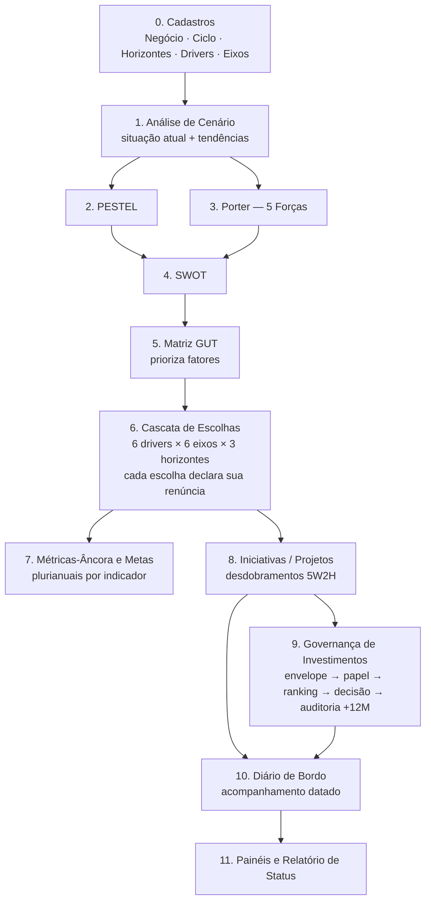

# Sistema de Planejamento Estratégico — Arquitetura Proposta

**Stack:** PHP 8.2+ (MVC próprio, **sem Laravel/framework**) · MySQL 8 · Integração Qlik Cloud (app Comercial Global)

Sistema de gestão do planejamento estratégico e de investimentos da Copérdia,
seguindo o modelo **"Planejamento por drivers e horizontes"** (ciclo 2027–2035),
substituindo as planilhas de reunião com gerentes de negócio.

---

## 1. O método (espinha dorsal do sistema)

O processo é conduzido em etapas encadeadas — cada uma alimenta a seguinte, com
rastreabilidade do diagnóstico até a alocação de capital:



**Conexões entre as etapas:**

- Fatores do **PESTEL** e do **Porter** são *promovidos* para a **SWOT** com um
  clique, mantendo o vínculo de origem.
- Itens da SWOT recebem notas **GUT** (G × U × T, 1–5); score e ranking automáticos.
- Os fatores priorizados no GUT **fundamentam as escolhas da cascata** — cada
  escolha pode referenciar os fatores que a motivaram.
- Cada **iniciativa/projeto** nasce de uma escolha da cascata (em especial do
  driver *Iniciativas Estruturantes*) e herda horizonte e driver.
- Investimentos seguem o funil de capital: **a cascata dá direção, não aprovação**
  — envelope (quanto há) → papel do investimento (agrupa antes de ordenar) →
  ranking por taxa de retorno → decisão com critério registrado → auditoria
  +12 meses (prometido × realizado).
- O **diário de bordo** registra o andamento com data e autor (nunca sobrescreve),
  e alimenta o relatório de status das reuniões.

Um **checklist de completude do método** no hub de cada planejamento mostra o
avanço das etapas.

---

## 2. Planejamento por drivers e horizontes

Estrutura central do ciclo 2027–2035, **cadastrável** (novos ciclos poderão ter
outros horizontes/drivers):

**Horizontes** — cadastro com nome, período, tema e objetivo:

| Horizonte | Período | Tema | Objetivo (exemplo do ciclo atual) |
|---|---|---|---|
| H1 | 2027–2029 | Recuperação | "Margem bruta antes de investimentos": margem da rede, eficiência, armazenagem priorizada, desalavancagem |
| H2 | 2030–2032 | Crescimento Seletivo | "Densidade": mais share por cooperado, não mais bandeiras |
| H3 | 2033–2035 | Consolidação | "Referência Regional": Copérdia mais rentável, armazenagem própria ≥ 70%, autonomia financeira |

**Drivers (linhas bases)** — 6, cadastráveis: Aonde Jogar · Como Vencer ·
Envelope · Capacidades e Recursos · Iniciativas Estruturantes · Métrica-Âncora.

**Eixos (aberturas)** — 6, cadastráveis: Mercado · Portfólio · Marca · Pessoas ·
Eficiência · Financeiro.

**A cascata:** para cada **negócio**, cada célula *driver × horizonte* tem uma
**síntese** (o texto que aparece na matriz, ex.: "Travado ±5% · guard-rails
bloqueantes") e **6 aberturas** — uma por eixo — cada qual com a **escolha** e a
**renúncia** declarada. São 6 × 6 × 3 = **108 escolhas por negócio**.

---

## 3. Cadastro de Negócios — integração Comercial Global (Qlik)

- Campos do cadastro: **`cod_negocio`** e **`negocio`** (+ gestor, ativo).
- Em todo campo de seleção o negócio aparece **concatenado**: `8 - Agropecuária`
  (formato `cod - nome`).
- Fonte: app **Comercial Global** (Qlik Cloud, espaço Filiais, appId
  `4aed35d9-bc8c-42dd-a5d7-ea13925a53b9`), campo `Negócio`. O app ainda não expõe
  o código do negócio — enquanto isso o código é informado no cadastro; quando o
  campo entrar na carga do Qlik, a sincronização passa a casar código + nome.
- Em produção o PHP consome a **API REST do Qlik Cloud** (job diário + botão
  "Sincronizar agora"); negócios ausentes na fonte são **inativados**, nunca
  excluídos.

---

## 4. Modelo de dados (MySQL 8)

Hierarquia: **`negocio` × `ciclo` → `planejamento`**; o ciclo tem `ano_base`
(ano em que o planejamento é elaborado) e seus `horizontes`.

```sql
-- ===== Base =====
CREATE TABLE usuario (
  id            INT AUTO_INCREMENT PRIMARY KEY,
  nome          VARCHAR(120) NOT NULL,
  email         VARCHAR(120) NOT NULL UNIQUE,
  senha_hash    VARCHAR(255) NOT NULL,
  perfil        ENUM('ADMIN','CONTROLADORIA','GESTOR','LEITURA') NOT NULL DEFAULT 'LEITURA',
  ativo         TINYINT(1) NOT NULL DEFAULT 1,
  criado_em     TIMESTAMP DEFAULT CURRENT_TIMESTAMP
) ENGINE=InnoDB DEFAULT CHARSET=utf8mb4;

CREATE TABLE negocio (
  id              INT AUTO_INCREMENT PRIMARY KEY,
  cod_negocio     VARCHAR(10) NOT NULL UNIQUE,     -- ex.: 8
  nome            VARCHAR(120) NOT NULL,           -- ex.: Agropecuária
  -- exibição em seleções: CONCAT(cod_negocio, ' - ', nome)  →  "8 - Agropecuária"
  gestor_id       INT NULL REFERENCES usuario(id),
  origem          ENUM('QLIK','MANUAL') NOT NULL DEFAULT 'MANUAL',
  sincronizado_em DATETIME NULL,
  ativo           TINYINT(1) NOT NULL DEFAULT 1
) ENGINE=InnoDB DEFAULT CHARSET=utf8mb4;

CREATE TABLE ciclo (
  id          INT AUTO_INCREMENT PRIMARY KEY,
  nome        VARCHAR(60) NOT NULL,                -- ex.: 2027–2035
  ano_base    SMALLINT NOT NULL,                   -- ano do planejamento, ex.: 2026
  ano_inicio  SMALLINT NOT NULL,
  ano_fim     SMALLINT NOT NULL,
  status      ENUM('EM_ELABORACAO','VIGENTE','ENCERRADO') NOT NULL DEFAULT 'EM_ELABORACAO'
) ENGINE=InnoDB DEFAULT CHARSET=utf8mb4;

CREATE TABLE horizonte (
  id          INT AUTO_INCREMENT PRIMARY KEY,
  ciclo_id    INT NOT NULL REFERENCES ciclo(id),
  nome        VARCHAR(30) NOT NULL,                -- H1, H2, H3
  ano_inicio  SMALLINT NOT NULL,
  ano_fim     SMALLINT NOT NULL,
  tema        VARCHAR(120) NOT NULL,               -- Recuperação / Crescimento Seletivo / Consolidação
  objetivo    TEXT NOT NULL,                       -- propósito do horizonte
  ordem       TINYINT NOT NULL DEFAULT 0
) ENGINE=InnoDB DEFAULT CHARSET=utf8mb4;

CREATE TABLE driver (                              -- linhas bases (cadastrável)
  id     INT AUTO_INCREMENT PRIMARY KEY,
  nome   VARCHAR(60) NOT NULL,                     -- Aonde Jogar, Como Vencer, Envelope,
  ordem  TINYINT NOT NULL DEFAULT 0,               -- Capacidades e Recursos,
  ativo  TINYINT(1) NOT NULL DEFAULT 1             -- Iniciativas Estruturantes, Métrica-Âncora
) ENGINE=InnoDB DEFAULT CHARSET=utf8mb4;

CREATE TABLE eixo (                                -- aberturas de cada linha base (cadastrável)
  id     INT AUTO_INCREMENT PRIMARY KEY,
  nome   VARCHAR(60) NOT NULL,                     -- Mercado, Portfólio, Marca,
  ordem  TINYINT NOT NULL DEFAULT 0,               -- Pessoas, Eficiência, Financeiro
  ativo  TINYINT(1) NOT NULL DEFAULT 1
) ENGINE=InnoDB DEFAULT CHARSET=utf8mb4;

CREATE TABLE planejamento (                        -- 1 negócio × 1 ciclo
  id          INT AUTO_INCREMENT PRIMARY KEY,
  negocio_id  INT NOT NULL REFERENCES negocio(id),
  ciclo_id    INT NOT NULL REFERENCES ciclo(id),
  UNIQUE KEY uk_neg_ciclo (negocio_id, ciclo_id)
) ENGINE=InnoDB DEFAULT CHARSET=utf8mb4;

-- ===== Diagnóstico =====
CREATE TABLE cenario_item (
  id               INT AUTO_INCREMENT PRIMARY KEY,
  planejamento_id  INT NOT NULL REFERENCES planejamento(id),
  tipo             ENUM('SITUACAO_ATUAL','TENDENCIA') NOT NULL,
  ordem            SMALLINT NOT NULL DEFAULT 0,
  descricao        TEXT NOT NULL
) ENGINE=InnoDB DEFAULT CHARSET=utf8mb4;

CREATE TABLE fator (                               -- PESTEL, Porter e SWOT unificados
  id               INT AUTO_INCREMENT PRIMARY KEY,
  planejamento_id  INT NOT NULL REFERENCES planejamento(id),
  etapa            ENUM('PESTEL','PORTER','SWOT') NOT NULL,
  categoria        VARCHAR(40) NOT NULL,
  -- PESTEL: POLITICO|ECONOMICO|SOCIAL|TECNOLOGICO|ECOLOGICO|LEGAL
  -- PORTER: RIVALIDADE|NOVOS_ENTRANTES|SUBSTITUTOS|PODER_FORNECEDORES|PODER_CLIENTES
  -- SWOT:   FORCA|FRAQUEZA|OPORTUNIDADE|AMEACA
  descricao        TEXT NOT NULL,
  promovido_de_id  INT NULL REFERENCES fator(id),  -- rastreio PESTEL/Porter → SWOT
  criado_em        TIMESTAMP DEFAULT CURRENT_TIMESTAMP
) ENGINE=InnoDB DEFAULT CHARSET=utf8mb4;

CREATE TABLE gut (
  fator_id   INT PRIMARY KEY REFERENCES fator(id),
  gravidade  TINYINT NOT NULL CHECK (gravidade  BETWEEN 1 AND 5),
  urgencia   TINYINT NOT NULL CHECK (urgencia   BETWEEN 1 AND 5),
  tendencia  TINYINT NOT NULL CHECK (tendencia  BETWEEN 1 AND 5),
  score      SMALLINT GENERATED ALWAYS AS (gravidade * urgencia * tendencia) STORED
) ENGINE=InnoDB DEFAULT CHARSET=utf8mb4;

-- ===== Cascata de escolhas (drivers × horizontes × eixos) =====
CREATE TABLE cascata_escolha (
  id               INT AUTO_INCREMENT PRIMARY KEY,
  planejamento_id  INT NOT NULL REFERENCES planejamento(id),
  horizonte_id     INT NOT NULL REFERENCES horizonte(id),
  driver_id        INT NOT NULL REFERENCES driver(id),
  eixo_id          INT NULL REFERENCES eixo(id),   -- NULL = síntese da célula driver×horizonte
  escolha          TEXT NOT NULL,                  -- o que foi decidido
  renuncia         TEXT,                           -- o que se declara abrir mão
  UNIQUE KEY uk_celula (planejamento_id, horizonte_id, driver_id, eixo_id)
) ENGINE=InnoDB DEFAULT CHARSET=utf8mb4;

CREATE TABLE cascata_fator (                       -- rastreio GUT/SWOT → escolha
  cascata_id INT NOT NULL REFERENCES cascata_escolha(id),
  fator_id   INT NOT NULL REFERENCES fator(id),
  PRIMARY KEY (cascata_id, fator_id)
) ENGINE=InnoDB DEFAULT CHARSET=utf8mb4;

-- ===== Métricas-âncora e metas plurianuais =====
CREATE TABLE indicador (
  id               INT AUTO_INCREMENT PRIMARY KEY,
  planejamento_id  INT NOT NULL REFERENCES planejamento(id),
  nome             VARCHAR(120) NOT NULL,          -- ex.: Cobertura de juros
  unidade          VARCHAR(20)  NOT NULL DEFAULT 'R$ mil',
  sentido          ENUM('MAIOR_MELHOR','MENOR_MELHOR') NOT NULL DEFAULT 'MAIOR_MELHOR',
  metrica_ancora   TINYINT(1) NOT NULL DEFAULT 0,  -- destaque no painel do horizonte
  horizonte_id     INT NULL REFERENCES horizonte(id)
) ENGINE=InnoDB DEFAULT CHARSET=utf8mb4;

CREATE TABLE indicador_valor (
  id            INT AUTO_INCREMENT PRIMARY KEY,
  indicador_id  INT NOT NULL REFERENCES indicador(id),
  ano           SMALLINT NOT NULL,
  tipo          ENUM('META','REAL') NOT NULL,
  versao_meta   TINYINT NOT NULL DEFAULT 1,        -- preserva revisões de meta
  valor         DECIMAL(15,2) NOT NULL,
  UNIQUE KEY uk_ind_ano (indicador_id, ano, tipo, versao_meta)
) ENGINE=InnoDB DEFAULT CHARSET=utf8mb4;

-- ===== Iniciativas / Projetos =====
CREATE TABLE projeto (
  id               INT AUTO_INCREMENT PRIMARY KEY,
  planejamento_id  INT NOT NULL REFERENCES planejamento(id),
  tipo             ENUM('ESTRATEGICO','OPERACIONAL') NOT NULL,
  titulo           TEXT NOT NULL,
  responsavel      VARCHAR(255),
  prazo            VARCHAR(60),
  horizonte_id     INT NULL REFERENCES horizonte(id),
  cascata_id       INT NULL REFERENCES cascata_escolha(id),  -- escolha que originou
  impacto          ENUM('RENTABILIDADE','FATURAMENTO','SUSTENTABILIDADE','PESSOAS') NULL,
  classificacao    ENUM('PRIORITARIO','NORMAL') NOT NULL DEFAULT 'NORMAL',
  status           ENUM('NAO_INICIADO','EM_ANDAMENTO','CONCLUIDO','ATRASADO','CANCELADO')
                   NOT NULL DEFAULT 'NAO_INICIADO',
  ordem            SMALLINT NOT NULL DEFAULT 0
) ENGINE=InnoDB DEFAULT CHARSET=utf8mb4;

CREATE TABLE desdobramento (                       -- plano de ação 5W2H
  id           INT AUTO_INCREMENT PRIMARY KEY,
  projeto_id   INT NOT NULL REFERENCES projeto(id),
  o_que        TEXT NOT NULL,
  por_que      TEXT,
  quem         VARCHAR(255),
  quando_      VARCHAR(60),
  onde         VARCHAR(120),
  como         TEXT,
  quanto       DECIMAL(15,2) NULL,
  status       ENUM('NAO_INICIADO','EM_ANDAMENTO','CONCLUIDO','ATRASADO','CANCELADO')
               NOT NULL DEFAULT 'NAO_INICIADO',
  progresso    TINYINT NOT NULL DEFAULT 0,
  ordem        SMALLINT NOT NULL DEFAULT 0
) ENGINE=InnoDB DEFAULT CHARSET=utf8mb4;

-- ===== Governança de investimentos (do plano ao capital) =====
CREATE TABLE envelope_capital (                    -- quanto há, por horizonte/negócio
  id               INT AUTO_INCREMENT PRIMARY KEY,
  planejamento_id  INT NOT NULL REFERENCES planejamento(id),
  horizonte_id     INT NOT NULL REFERENCES horizonte(id),
  valor_limite     DECIMAL(15,2) NOT NULL,
  flex_percentual  DECIMAL(5,2) NOT NULL DEFAULT 0, -- ±5 / ±20 / ±40
  regras           TEXT                             -- guard-rails, condições (ROIC > WACC...)
) ENGINE=InnoDB DEFAULT CHARSET=utf8mb4;

CREATE TABLE investimento (
  id               INT AUTO_INCREMENT PRIMARY KEY,
  planejamento_id  INT NOT NULL REFERENCES planejamento(id),
  projeto_id       INT NULL REFERENCES projeto(id),
  horizonte_id     INT NULL REFERENCES horizonte(id),
  descricao        TEXT NOT NULL,
  papel            ENUM('OBRIGATORIO','MANUTENCAO','EFICIENCIA','CRESCIMENTO','ESTRATEGICO') NULL,
  ano              SMALLINT NOT NULL,
  valor            DECIMAL(15,2) NOT NULL,
  taxa_retorno     DECIMAL(6,2) NULL,              -- % — base do ranking (retorno por real investido)
  situacao         ENUM('PROPOSTO','RANQUEADO','APROVADO','REPROVADO','EXECUTADO','AUDITADO')
                   NOT NULL DEFAULT 'PROPOSTO',
  decisao_criterio TEXT,                           -- critério registrado na decisão
  decisao_data     DATE NULL,
  valor_realizado  DECIMAL(15,2) NULL,             -- auditoria +12M
  auditoria_nota   TEXT                            -- prometido × realizado
) ENGINE=InnoDB DEFAULT CHARSET=utf8mb4;

-- ===== Diário de bordo =====
CREATE TABLE diario_bordo (
  id           INT AUTO_INCREMENT PRIMARY KEY,
  ref_tipo     ENUM('PROJETO','DESDOBRAMENTO','INVESTIMENTO','CASCATA') NOT NULL,
  ref_id       INT NOT NULL,
  data_reg     DATE NOT NULL,
  autor_id     INT NOT NULL REFERENCES usuario(id),
  texto        TEXT NOT NULL,
  status_atual ENUM('NAO_INICIADO','EM_ANDAMENTO','CONCLUIDO','ATRASADO','CANCELADO') NULL,
  progresso    TINYINT NULL,
  criado_em    TIMESTAMP DEFAULT CURRENT_TIMESTAMP,
  KEY idx_ref (ref_tipo, ref_id, data_reg)
) ENGINE=InnoDB DEFAULT CHARSET=utf8mb4;
```

**Seeds iniciais** (`database/seeds.sql`): os 6 drivers, os 6 eixos, o ciclo
2027–2035 (`ano_base` 2026) com os horizontes H1/H2/H3 e seus objetivos, e os
negócios com códigos (ex.: `8 - Agropecuária`).

---

## 5. Estrutura da aplicação PHP (sem framework)

```
/planejamento
├── public/
│   ├── index.php            # front controller (router próprio)
│   └── assets/              # css, js (Bootstrap 5), logos Copérdia
├── app/
│   ├── Core/                # Router, Database (PDO), Auth, View, Csrf
│   ├── Controllers/
│   │   ├── NegocioController.php      # cód + nome, seleção "8 - Agropecuária", sync Qlik
│   │   ├── CicloController.php        # ciclo, ano_base, horizontes e objetivos
│   │   ├── DriverEixoController.php   # cadastro de drivers e eixos
│   │   ├── PlanejamentoController.php # hub do método (checklist)
│   │   ├── CenarioController.php
│   │   ├── PestelController.php
│   │   ├── PorterController.php
│   │   ├── SwotController.php
│   │   ├── GutController.php
│   │   ├── CascataController.php      # matriz drivers × horizontes + 6 aberturas/eixo
│   │   ├── MetasController.php        # indicadores, métricas-âncora, metas plurianuais
│   │   ├── ProjetoController.php      # iniciativas + desdobramentos 5W2H
│   │   ├── InvestimentoController.php # envelope, papel, ranking, decisão, auditoria
│   │   ├── DiarioController.php
│   │   └── RelatorioController.php    # painéis + relatório de status (PDF/XLSX)
│   ├── Models/
│   └── Services/QlikSync.php
├── views/
├── database/ (schema.sql, seeds.sql)
├── config/config.php        # credenciais via variáveis de ambiente
└── composer.json            # autoload PSR-4 + PhpSpreadsheet/Dompdf apenas
```

**Segurança:** sessões + `password_hash()`, CSRF token, prepared statements em
todas as queries; GESTOR edita apenas seus negócios, CONTROLADORIA/ADMIN tudo,
LEITURA vê painéis e relatórios.

---

## 6. Telas (mapa de navegação)

| # | Tela | Conteúdo |
|---|------|----------|
| 0 | Login | autenticação e perfil |
| 1 | Painel Consolidado | todos os negócios: avanço da cascata, atrasos, envelope × comprometido por horizonte |
| 2 | Cadastros | negócios (cód + nome, sync Qlik), ciclos com ano do planejamento, horizontes e objetivos, drivers, eixos |
| 3 | Planejamento (hub) | seleção "8 - Agropecuária" × ciclo; checklist das etapas |
| 4 | Análise de Cenário | situação atual + tendências |
| 5 | PESTEL | 6 categorias; "promover para SWOT" |
| 6 | Porter | 5 forças; "promover para SWOT" |
| 7 | SWOT | 4 quadrantes com badge de origem |
| 8 | Matriz GUT | notas G/U/T, ranking, "usar na cascata" |
| 9 | **Cascata de Escolhas** | matriz drivers × horizontes (como o slide); clique na célula abre a síntese + 6 aberturas por eixo, cada uma com escolha e renúncia; contador 108/108 |
| 10 | Metas | métricas-âncora por horizonte + tabela plurianual meta/real |
| 11 | Projetos | iniciativas vinculadas a horizonte/escolha; desdobramentos 5W2H |
| 12 | **Governança de Investimentos** | funil: envelope → papel → ranking por taxa de retorno → decisão (critério registrado) → auditoria +12M |
| 13 | Diário de Bordo | timeline por projeto/desdobramento/investimento |
| 14 | Relatório de Status | documento da reunião por período/negócio (tela, PDF, XLSX) |

---

## 7. Roadmap de implementação

| Fase | Entrega | Conteúdo |
|------|---------|----------|
| 1 | Fundação | MVC, login/perfis, cadastros (negócio + sync Qlik, ciclo/ano_base, horizontes, drivers, eixos), hub |
| 2 | Diagnóstico | cenário, PESTEL, Porter, SWOT, GUT |
| 3 | Cascata | matriz de escolhas com aberturas por eixo e renúncias, vínculo com fatores GUT |
| 4 | Execução | projetos/desdobramentos 5W2H, diário de bordo |
| 5 | Capital | envelope, papel, ranking, decisão, auditoria +12M |
| 6 | Gestão | métricas-âncora, metas plurianuais, painéis, relatório de status, importação das planilhas 2026 |

---

*O protótipo Streamlit no repositório validou o conceito inicial e será
substituído pela aplicação PHP conforme este documento.*
