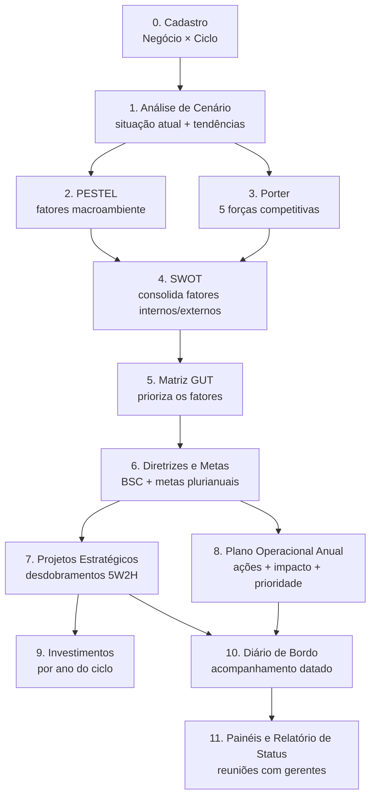

# Sistema de Planejamento Estratégico — Arquitetura Proposta

**Stack:** PHP 8.2+ · MySQL 8 · Integração com Qlik Cloud (app Comercial Global)

Este documento define a estrutura do sistema de gestão do planejamento estratégico e
operacional da Copérdia, substituindo as planilhas de reunião (ex.:
`2026 SUPERMERCADO REUNIÃO PRÉVIA COM GERENTES DE NEGÓCIO`).

---

## 1. O método (espinha dorsal do sistema)

O sistema conduz o gestor por um fluxo encadeado — cada etapa alimenta a seguinte,
garantindo rastreabilidade do diagnóstico até a execução:



**Conexões entre etapas (o diferencial sobre o Excel):**

- Fatores levantados no **PESTEL** e no **Porter** podem ser *promovidos* para a
  **SWOT** (oportunidade ou ameaça) com um clique — mantendo o vínculo de origem.
- Todo item da SWOT pode receber notas **GUT** (Gravidade × Urgência × Tendência,
  1–5); o score G×U×T gera o ranking de prioridades automaticamente.
- Todo **projeto** referencia o(s) fator(es) que o motivaram — respondendo sempre
  "por que este projeto existe?".
- Cada desdobramento de projeto/ação registra seu andamento no **diário de bordo**
  (registros datados, nunca sobrescritos — hoje a coluna "situação atual" da
  planilha perde o histórico).
- O **relatório de status** para as reuniões é gerado a partir do diário de bordo
  do período selecionado.

Um **checklist de completude do método** na tela inicial de cada planejamento
mostra quais etapas foram concluídas (cenário ✓, PESTEL ✓, Porter ✗ ...),
formalizando o processo.

---

## 2. Cadastro de Negócios — integração Comercial Global (Qlik via MCP)

Verificação feita no app **Comercial Global** (Qlik Cloud, espaço Filiais,
appId `4aed35d9-bc8c-42dd-a5d7-ea13925a53b9`):

- Campo **`Negócio`** disponível, com os valores: NEGOCIO SUPERMERCADOS, NEGOCIO
  CEREAIS, NEGOCIO LEITE, NEGOCIO LOJAS AGROPECUARIAS, NEGOCIO PECUARIA, NEGOCIO
  POSTO COMBUSTIVEIS, NEGOCIO FABRICA DE RACOES, NEGOCIO REFLORESTAMENTO, NEGOCIO
  UTM, UBS UNID.BENEF.SEMENTES, USINA FOTOVOLTAICA, POSTO RESFRIAMENTO DE LEITE,
  AREA ADMINISTRACAO MATRIZ, AREA APOIO OPERACIONAL.
- O app **não expõe um "Cód. Negócio" numérico** (há `Cód. Filial`, `Cód Atividade`,
  mas não código do negócio).

**Decisão de projeto:** a tabela `negocio` guarda `cod_negocio` + `nome`. A
sincronização traz os nomes do Comercial Global; o código é o do ERP quando o
campo for exposto no app (basta incluir na carga do Qlik) ou, até lá, um código
interno definido no cadastro. Negócios que saírem da fonte são inativados, nunca
excluídos (preservam histórico de planejamentos).

**Como o PHP acessa o Qlik:** MCP é o canal desta bancada de trabalho (Claude);
em produção o PHP consome a **API REST do Qlik Cloud** (api key do tenant
`coperdia.br.qlikcloud.com`) por um job de sincronização (cron diário + botão
"Sincronizar agora" na tela de cadastro). A tabela guarda `origem = 'QLIK'` e
`sincronizado_em`.

---

## 3. Modelo de dados (MySQL 8)

Hierarquia central: **`negocio` × `ciclo` → `planejamento`** — todas as demais
tabelas penduram no planejamento.

```sql
-- ===== Base =====
CREATE TABLE usuario (
  id            INT AUTO_INCREMENT PRIMARY KEY,
  nome          VARCHAR(120) NOT NULL,
  email         VARCHAR(120) NOT NULL UNIQUE,
  senha_hash    VARCHAR(255) NOT NULL,
  perfil        ENUM('ADMIN','CONTROLADORIA','GESTOR','LEITURA') NOT NULL DEFAULT 'LEITURA',
  ativo         TINYINT(1) NOT NULL DEFAULT 1,
  criado_em     TIMESTAMP DEFAULT CURRENT_TIMESTAMP
) ENGINE=InnoDB DEFAULT CHARSET=utf8mb4;

CREATE TABLE negocio (
  id              INT AUTO_INCREMENT PRIMARY KEY,
  cod_negocio     VARCHAR(20) NOT NULL UNIQUE,      -- código ERP ou interno
  nome            VARCHAR(120) NOT NULL,            -- ex.: NEGOCIO SUPERMERCADOS
  gestor_id       INT NULL REFERENCES usuario(id),
  origem          ENUM('QLIK','MANUAL') NOT NULL DEFAULT 'MANUAL',
  sincronizado_em DATETIME NULL,
  ativo           TINYINT(1) NOT NULL DEFAULT 1
) ENGINE=InnoDB DEFAULT CHARSET=utf8mb4;

CREATE TABLE ciclo (
  id          INT AUTO_INCREMENT PRIMARY KEY,
  nome        VARCHAR(60) NOT NULL,                 -- ex.: 2026–2030
  ano_inicio  SMALLINT NOT NULL,
  ano_fim     SMALLINT NOT NULL,
  status      ENUM('EM_ELABORACAO','VIGENTE','ENCERRADO') NOT NULL DEFAULT 'EM_ELABORACAO'
) ENGINE=InnoDB DEFAULT CHARSET=utf8mb4;

CREATE TABLE planejamento (                          -- 1 negócio × 1 ciclo
  id          INT AUTO_INCREMENT PRIMARY KEY,
  negocio_id  INT NOT NULL REFERENCES negocio(id),
  ciclo_id    INT NOT NULL REFERENCES ciclo(id),
  UNIQUE KEY uk_neg_ciclo (negocio_id, ciclo_id)
) ENGINE=InnoDB DEFAULT CHARSET=utf8mb4;

-- ===== Etapa 1: Análise de Cenário =====
CREATE TABLE cenario_item (
  id               INT AUTO_INCREMENT PRIMARY KEY,
  planejamento_id  INT NOT NULL REFERENCES planejamento(id),
  tipo             ENUM('SITUACAO_ATUAL','TENDENCIA') NOT NULL,
  ordem            SMALLINT NOT NULL DEFAULT 0,
  descricao        TEXT NOT NULL
) ENGINE=InnoDB DEFAULT CHARSET=utf8mb4;

-- ===== Etapas 2–4: fatores (PESTEL, Porter, SWOT) — tabela unificada =====
CREATE TABLE fator (
  id               INT AUTO_INCREMENT PRIMARY KEY,
  planejamento_id  INT NOT NULL REFERENCES planejamento(id),
  etapa            ENUM('PESTEL','PORTER','SWOT') NOT NULL,
  categoria        VARCHAR(40) NOT NULL,
  -- PESTEL: POLITICO|ECONOMICO|SOCIAL|TECNOLOGICO|ECOLOGICO|LEGAL
  -- PORTER: RIVALIDADE|NOVOS_ENTRANTES|SUBSTITUTOS|PODER_FORNECEDORES|PODER_CLIENTES
  -- SWOT:   FORCA|FRAQUEZA|OPORTUNIDADE|AMEACA
  descricao        TEXT NOT NULL,
  promovido_de_id  INT NULL REFERENCES fator(id),   -- rastreio PESTEL/Porter → SWOT
  criado_em        TIMESTAMP DEFAULT CURRENT_TIMESTAMP
) ENGINE=InnoDB DEFAULT CHARSET=utf8mb4;

-- ===== Etapa 5: Matriz GUT (sobre fatores da SWOT) =====
CREATE TABLE gut (
  fator_id   INT PRIMARY KEY REFERENCES fator(id),
  gravidade  TINYINT NOT NULL CHECK (gravidade  BETWEEN 1 AND 5),
  urgencia   TINYINT NOT NULL CHECK (urgencia   BETWEEN 1 AND 5),
  tendencia  TINYINT NOT NULL CHECK (tendencia  BETWEEN 1 AND 5),
  score      SMALLINT GENERATED ALWAYS AS (gravidade * urgencia * tendencia) STORED
) ENGINE=InnoDB DEFAULT CHARSET=utf8mb4;

-- ===== Etapa 6: Diretrizes BSC e Metas Plurianuais =====
CREATE TABLE objetivo_bsc (
  id               INT AUTO_INCREMENT PRIMARY KEY,
  planejamento_id  INT NOT NULL REFERENCES planejamento(id),
  perspectiva      ENUM('FINANCEIRA','CLIENTES','PROCESSOS','APRENDIZADO') NOT NULL,
  titulo           VARCHAR(255) NOT NULL,
  descricao        TEXT
) ENGINE=InnoDB DEFAULT CHARSET=utf8mb4;

CREATE TABLE indicador (
  id               INT AUTO_INCREMENT PRIMARY KEY,
  planejamento_id  INT NOT NULL REFERENCES planejamento(id),
  nome             VARCHAR(120) NOT NULL,           -- ex.: FATURAMENTO BRUTO
  unidade          VARCHAR(20)  NOT NULL DEFAULT 'R$ mil',
  sentido          ENUM('MAIOR_MELHOR','MENOR_MELHOR') NOT NULL DEFAULT 'MAIOR_MELHOR'
) ENGINE=InnoDB DEFAULT CHARSET=utf8mb4;

CREATE TABLE indicador_valor (                      -- série meta/real por ano
  id            INT AUTO_INCREMENT PRIMARY KEY,
  indicador_id  INT NOT NULL REFERENCES indicador(id),
  ano           SMALLINT NOT NULL,
  tipo          ENUM('META','REAL') NOT NULL,
  versao_meta   TINYINT NOT NULL DEFAULT 1,        -- preserva revisões (META 1, 2...)
  valor         DECIMAL(15,2) NOT NULL,
  UNIQUE KEY uk_ind_ano (indicador_id, ano, tipo, versao_meta)
) ENGINE=InnoDB DEFAULT CHARSET=utf8mb4;

-- ===== Etapas 7–8: Projetos (estratégicos e plano operacional) =====
CREATE TABLE projeto (
  id               INT AUTO_INCREMENT PRIMARY KEY,
  planejamento_id  INT NOT NULL REFERENCES planejamento(id),
  tipo             ENUM('ESTRATEGICO','OPERACIONAL') NOT NULL,
  titulo           TEXT NOT NULL,
  responsavel      VARCHAR(255),
  prazo            VARCHAR(60),                     -- livre, como na planilha
  impacto          ENUM('RENTABILIDADE','FATURAMENTO','SUSTENTABILIDADE','PESSOAS') NULL,
  classificacao    ENUM('PRIORITARIO','NORMAL') NOT NULL DEFAULT 'NORMAL',
  objetivo_bsc_id  INT NULL REFERENCES objetivo_bsc(id),
  status           ENUM('NAO_INICIADO','EM_ANDAMENTO','CONCLUIDO','ATRASADO','CANCELADO')
                   NOT NULL DEFAULT 'NAO_INICIADO',
  ordem            SMALLINT NOT NULL DEFAULT 0
) ENGINE=InnoDB DEFAULT CHARSET=utf8mb4;

CREATE TABLE projeto_fator (                        -- rastreio diagnóstico → projeto
  projeto_id INT NOT NULL REFERENCES projeto(id),
  fator_id   INT NOT NULL REFERENCES fator(id),
  PRIMARY KEY (projeto_id, fator_id)
) ENGINE=InnoDB DEFAULT CHARSET=utf8mb4;

CREATE TABLE desdobramento (                        -- plano de ação 5W2H
  id           INT AUTO_INCREMENT PRIMARY KEY,
  projeto_id   INT NOT NULL REFERENCES projeto(id),
  o_que        TEXT NOT NULL,                       -- What
  por_que      TEXT,                                -- Why
  quem         VARCHAR(255),                        -- Who
  quando_      VARCHAR(60),                         -- When
  onde         VARCHAR(120),                        -- Where
  como         TEXT,                                -- How
  quanto       DECIMAL(15,2) NULL,                  -- How much
  status       ENUM('NAO_INICIADO','EM_ANDAMENTO','CONCLUIDO','ATRASADO','CANCELADO')
               NOT NULL DEFAULT 'NAO_INICIADO',
  progresso    TINYINT NOT NULL DEFAULT 0,          -- 0–100
  ordem        SMALLINT NOT NULL DEFAULT 0
) ENGINE=InnoDB DEFAULT CHARSET=utf8mb4;

-- ===== Etapa 9: Investimentos =====
CREATE TABLE investimento (
  id               INT AUTO_INCREMENT PRIMARY KEY,
  planejamento_id  INT NOT NULL REFERENCES planejamento(id),
  projeto_id       INT NULL REFERENCES projeto(id),
  descricao        TEXT NOT NULL,
  ano              SMALLINT NOT NULL,
  valor            DECIMAL(15,2) NOT NULL,
  aprovado_conselho TINYINT(1) NOT NULL DEFAULT 0
) ENGINE=InnoDB DEFAULT CHARSET=utf8mb4;

-- ===== Etapa 10: Diário de Bordo (log de acompanhamento) =====
CREATE TABLE diario_bordo (
  id           INT AUTO_INCREMENT PRIMARY KEY,
  ref_tipo     ENUM('PROJETO','DESDOBRAMENTO') NOT NULL,
  ref_id       INT NOT NULL,
  data_reg     DATE NOT NULL,
  autor_id     INT NOT NULL REFERENCES usuario(id),
  texto        TEXT NOT NULL,                       -- a "situação atual" datada
  status_atual ENUM('NAO_INICIADO','EM_ANDAMENTO','CONCLUIDO','ATRASADO','CANCELADO') NULL,
  progresso    TINYINT NULL,
  criado_em    TIMESTAMP DEFAULT CURRENT_TIMESTAMP,
  KEY idx_ref (ref_tipo, ref_id, data_reg)
) ENGINE=InnoDB DEFAULT CHARSET=utf8mb4;
```

Registrar no diário de bordo com `status_atual`/`progresso` também atualiza o
desdobramento — um único gesto alimenta o log e o painel.

---

## 4. Estrutura da aplicação PHP

MVC enxuto, sem framework pesado — fácil de hospedar em qualquer servidor
Apache/Nginx + PHP-FPM da cooperativa. Composer apenas para autoload e libs
pontuais (ex.: PhpSpreadsheet para exportar o relatório).

```
/planejamento
├── public/                  # docroot
│   ├── index.php            # front controller (router)
│   └── assets/              # css, js (Bootstrap 5), logos
├── app/
│   ├── Core/                # Router, Database (PDO), Auth, View
│   ├── Controllers/
│   │   ├── NegocioController.php      # cadastro + sync Qlik
│   │   ├── CicloController.php
│   │   ├── PlanejamentoController.php # hub do método (checklist etapas)
│   │   ├── CenarioController.php
│   │   ├── PestelController.php
│   │   ├── PorterController.php
│   │   ├── SwotController.php         # inclui promoção de fatores
│   │   ├── GutController.php
│   │   ├── MetasController.php        # BSC + indicadores plurianuais
│   │   ├── ProjetoController.php      # estratégicos + operacionais + 5W2H
│   │   ├── InvestimentoController.php
│   │   ├── DiarioController.php
│   │   └── RelatorioController.php    # painéis + status p/ reunião (PDF/XLSX)
│   ├── Models/              # 1 classe por tabela (PDO prepared statements)
│   └── Services/
│       └── QlikSync.php     # API REST Qlik Cloud → tabela negocio
├── views/                   # templates PHP por módulo
├── database/
│   ├── schema.sql           # DDL acima
│   └── seeds.sql            # perfis, ciclo 2026–2030, negócios iniciais
├── config/config.php        # credenciais via variáveis de ambiente
└── composer.json
```

**Segurança:** sessões PHP + senha `password_hash()`; CSRF token nos formulários;
prepared statements em 100% das queries; perfis — GESTOR edita apenas o(s)
negócio(s) sob sua responsabilidade, CONTROLADORIA/ADMIN editam tudo, LEITURA
(diretoria/conselho) vê painéis e relatórios.

---

## 5. Telas (mapa de navegação)

| # | Tela | Conteúdo |
|---|------|----------|
| 0 | Login | autenticação e perfil |
| 1 | Painel Consolidado | diretoria: todos os negócios — % avanço, atrasos, investimentos por ano |
| 2 | Planejamento (hub) | seleção negócio × ciclo, checklist das etapas do método |
| 3 | Análise de Cenário | situação atual + tendências (itens numerados) |
| 4 | PESTEL | 6 colunas; botão "promover para SWOT" em cada fator |
| 5 | Porter | 5 forças; botão "promover para SWOT" |
| 6 | SWOT | 4 quadrantes; badge de origem (PESTEL/Porter) nos itens promovidos |
| 7 | Matriz GUT | notas G, U, T por fator SWOT; ranking automático; botão "gerar projeto" |
| 8 | Metas | BSC + tabela plurianual meta/real por indicador (estilo aba 2026 2030) |
| 9 | Projetos | lista estratégicos/operacionais; detalhe com desdobramentos 5W2H |
| 10 | Investimentos | grade ano × investimento, total por ano, flag conselho |
| 11 | Diário de Bordo | timeline por projeto/desdobramento; novo registro atualiza status |
| 12 | Relatório de Status | filtro por período/negócio → documento da reunião (tela, PDF, XLSX) |

---

## 6. Roadmap de implementação

| Fase | Entrega | Conteúdo |
|------|---------|----------|
| 1 | Fundação | estrutura MVC, login/perfis, cadastro negócio (com sync Qlik), ciclo, hub do planejamento |
| 2 | Diagnóstico | cenário, PESTEL, Porter, SWOT com promoção de fatores, GUT com ranking |
| 3 | Execução | projetos estratégicos/operacionais, desdobramentos 5W2H, investimentos, diário de bordo |
| 4 | Gestão | metas plurianuais, painéis, relatório de status exportável |
| 5 | Evolução | importação das planilhas 2026 existentes, indicadores automáticos via Qlik, notificações de atraso |

---

*Observação: o protótipo Streamlit existente no repositório serviu para validar o
conceito e será substituído pela aplicação PHP conforme este documento.*
